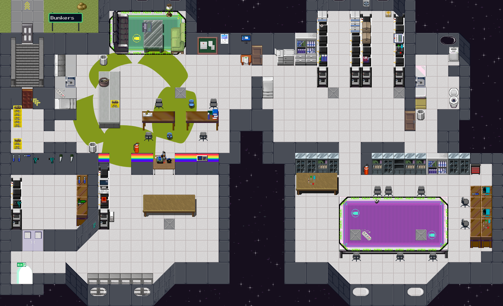
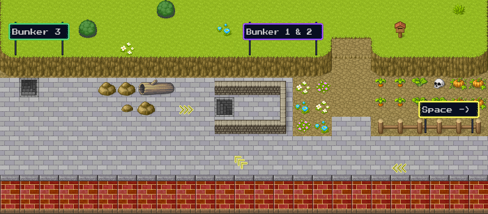
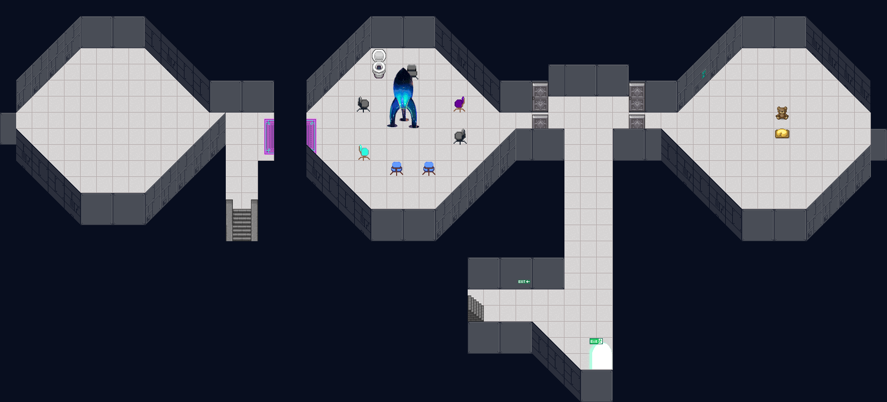

# space_tiles

This is a 2D layout of Space and the bunkers for the Labitat assembly during RC3. It was accesible by joining the RC3 world, which is running on [Workadventure](https://github.com/thecodingmachine/workadventure).

The assembly map is created with [Tiled](https://www.mapeditor.org/) and with help from the [world-map-starterkit](https://git.cccv.de/rc3/world-map-starterkit).

## Testing

Hop onto the RC3 test servers: [https://wa.tabascoeye.de/_/global/raw.githubusercontent.com/labitat/space_tiles/master/main.json](https://wa.tabascoeye.de/_/global/raw.githubusercontent.com/labitat/space_tiles/master/main.json)

## Screenshots

## Self hosting
It is of course possible to host your own Workadventure, see its repository for details [https://github.com/thecodingmachine/workadventure](https://github.com/thecodingmachine/workadventure).

## Resources

* RC3 world howto [https://howto.rc3.world/maps.en.html](https://howto.rc3.world/maps.en.html)
* RC3 world shared tiles repository [https://git.cccv.de/rc3/world-tiles](https://git.cccv.de/rc3/world-tiles) or [https://tiles.rc3.world/](https://tiles.rc3.world/)
* Workadventure tips [https://codimd.c3d2.de/WA-Zone-Einstieg-06](https://codimd.c3d2.de/WA-Zone-Einstieg-06)

